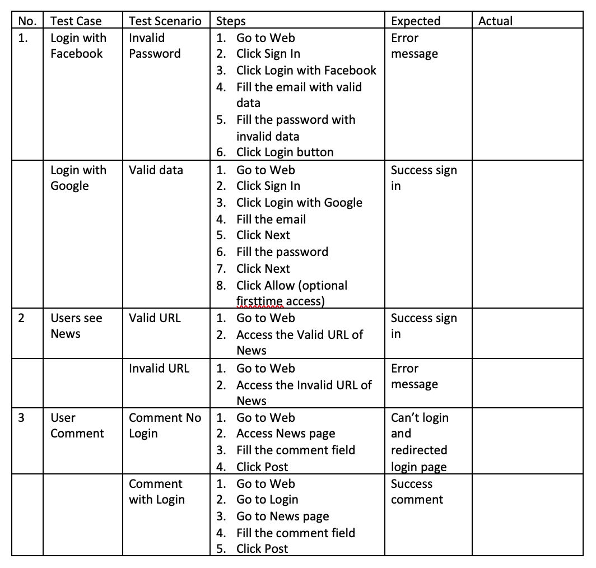
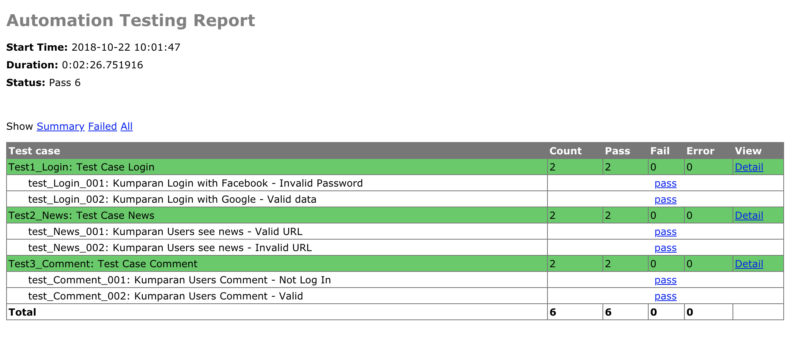
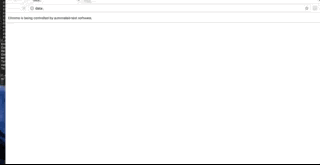

### Automation Testing Kumparan.com apps

### Requirements
- EasyProcess      0.2.3  
- pip              18.1   
- PyVirtualDisplay 0.2.1  
- selenium         3.14.1
- setuptools       40.4.3
- urllib3          1.24   
- wheel            0.32.2

### Chrome Driver
- ChromeDriver 2.43
- directory "../driver"

### How to use
1. Download chromedriver https://sites.google.com/a/chromium.org/chromedriver/downloads
2. Buat directory "driver" diluar directory project "../driver"
3. Masukkan file chromedriver ke dalam folder tersebut
4. Install requirements
- $ sudo easy_install pip
- $ sudo pip install virtualenv
- $ virtualenv venv
- $ source venv/bin/activate
- $ pip install -r requirements.txt
5. Run automation
- $ python test.py https://kumparan.com/ Chrome > report.html

#### Note :
- browser = Chrome / HEADLESS / VM / Default: Chrome
- Test Report = Report/Report.html (HTMLTestRunner)

### Test Case

